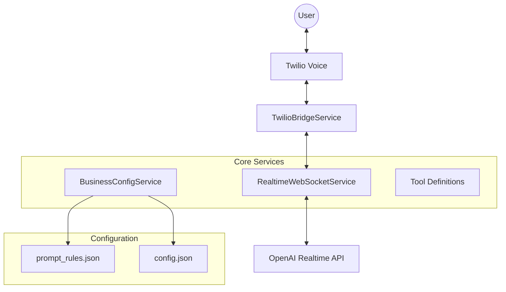

# Current System Architecture
**As of January 13, 2026**

## Overview
The system is a **multi-tenant AI voice agent platform** that integrates Twilio Voice with OpenAI's Realtime API. It has transitioned from code-heavy conversation handlers to a **prompt-driven architecture**, where business logic is primarily defined in system prompts and configuration files.

## High-Level Architecture

## Core Components

### 1. Telephony Layer (`TwilioBridgeService.js`)
*   **Role:** Bridges the audio stream between Twilio (Phone) and OpenAI.
*   **Function:**
    *   Receives µ-law audio from Twilio Media Streams.
    *   Forwards audio to OpenAI Realtime API.
    *   Handles session context (call forwarding, return-from-transfer).

### 2. AI Orchestration (`RealtimeWebSocketService.js`)
*   **Role:** Manages the connection with OpenAI and defines the agent's capabilities.
*   **Key Responsibilities:**
    *   **Session Management:** Creates and configures OpenAI sessions.
    *   **Tool Definition:** Dynamically loads tools (functions) based on the business ID (e.g., `validate_phone_number` for Superior Fencing, `route_call` for Nourish Oregon).
    *   **State Management:** Tracks conversation state (collected info) and injects it into the context via `get_collection_status`.
    *   **Temperature:** Configured to **0.6** for balance between conversational naturalness and factual adherence.

### 3. Multi-Tenant Configuration (`BusinessConfigService.js`)
*   **Role:** Loads business-specific logic.
*   **Structure:**
    *   `configs/businesses/{businessId}/config.json`: Static settings (phone numbers, hours, enabled features).
    *   `configs/businesses/{businessId}/prompt_rules.json`: The "Brain" of the agent. Contains the system prompt (`realtimeSystem`) and logic rules.

### 4. Prompt-Driven Logic
Instead of hardcoded state machines, the behavior is now defined in the **System Prompt**:
*   **Source of Truth:** The `get_collection_status` tool provides booleans (`nameCollected`, `reasonCollected`, etc.).
*   **Logic:** The prompt instructs the model to check these booleans before every response to determine the next step (e.g., "If `phoneCollected=false`, ask for phone").

## Data Flow (Example: Superior Fencing)

1.  **Inbound Call:** Twilio receives call -> `twilio-voice.js` identifies business via phone number.
2.  **Session Start:** `RealtimeWebSocketService` initializes session, loads `prompt_rules.json` for Superior Fencing.
3.  **Conversation:**
    *   User speaks -> Audio sent to OpenAI.
    *   OpenAI processes audio + System Prompt.
    *   **Tool Call:** OpenAI calls `validate_phone_number` with user input.
    *   **System Action:** Code validates format, returns JSON result.
    *   **Response:** OpenAI generates response based on tool result ("Thanks, I have your number...").
4.  **Completion:** Once `allCollected=true`, OpenAI asks for final confirmation and ends call via `end_conversation`.

## Key Directories

*   `configs/businesses/`: Business-specific configurations and prompts.
*   `features/voice-agent/services/realtime/`: Core WebSocket and Bridge services.
*   `features/voice-agent/routes/`: Webhook endpoints for Twilio.
*   `shared/services/`: Shared utilities (Config, Email, etc.).

## Legacy Components (Removed/Deprecated)
*   `SuperiorFencingHandler.js`: Removed. Logic moved to `prompt_rules.json`.
*   Complex state machines in code are being replaced by tool-use patterns in the LLM.